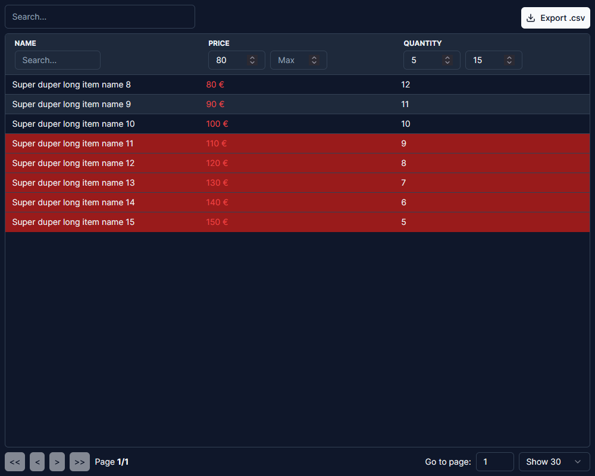

# react-table X shadcn/ui

this little demo projects aims to provide a re-usable table component that fits the style of [shadcn/ui](https://github.com/shadcn/ui)



## Sample

To reacreate the table seen above use the following snippet:

```typescript
import { Table } from "@/components/ui/table"

<Table
  data={dummyData()}
  columns={cols}
  stripedRows
  showGlobalFilter
  showColumnFilters
  showPagination
  handleDblClick={handleDblClick}
  getRowStyles={getRowStyles}
  className="h-[800px] w-[1000px] p-2"
/>
```

## Functionality

- stripedRows (default: false): alternates the row background-color
- showFooter (default: false): shows the footer of the table
- showGlobalFilter (default: false): adds a global text-filter on top of the table
- showColumnFilters (default: false): adds a filter to each column
- showPagination (default: false): adds pagination to the table (page-size: 10)
- pageSizes (default: [10,20,30,50]): let's you change the available pagesizes
- allowExportCSV: (default: false): allows to export the filtered rows as .csv
- handleDblClick: lets you pass in a function to handle double-clicks
- getRowStyles: lets you pass in a function to style rows based on cell values

## Contribution

I would love to get some c&c on everything like coding style, structure and everything :) Also feel free to create pull requests if you would change something about the table.

## Roadmap

Nothing for now but would love to add some stuff. So let me know if you have some cool ideas. <3
