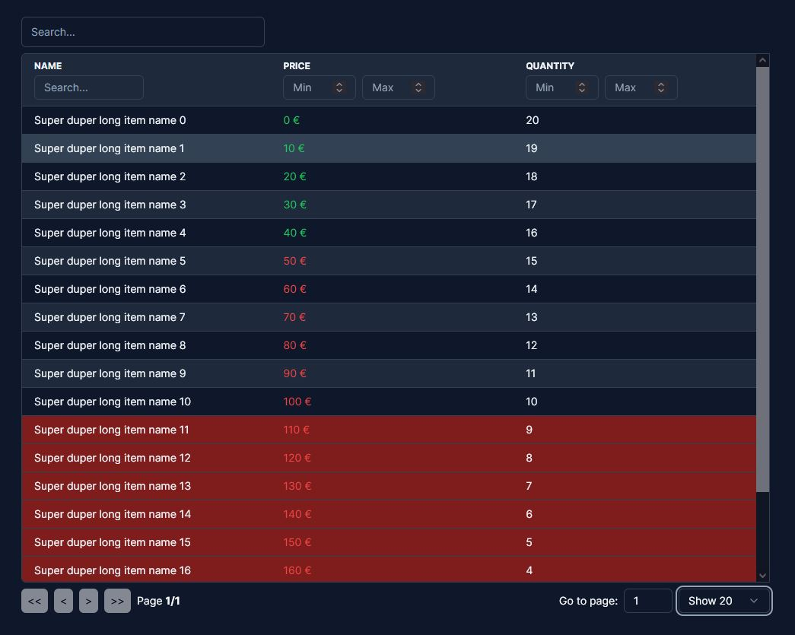

# react-table X shadcn/ui

this little demo projects aims to provide a re-usable table component that fits the style of [shadcn/ui](https://github.com/shadcn/ui)

## Contribution

I would love to get some c&c on everything like coding style, structure and everything :) Also feel free to create pull requests if you would change something about the table.

## Roadmap

- [ ] clean up / beautify pagination
- [ ] split table into parts (global filter, table, pagination) to clean up the code
- [ ] check if there is a way to bundle the tailwind styles at a specific location to make it easier to change stuff
- [ ] add i18n capability to keep it flexible
